# KnowSAM / A3-RCP-KnowSAM 中 SAM 提示来源流程图与详细说明

更新时间：2026-04-24

## 1. 文档目的

本文档用于回答以下三个关键问题：

1. KnowSAM 中 `fusion_map` 是如何得到的？
2. 当前框架里是否存在类似原始 SAM 的人工提示？
3. 在 KnowSAM 与 A3-RCP-KnowSAM 中，SAM 分别是如何被提示的？

为了便于组会汇报，本文档采用“流程图 + 逐节点解释”的方式说明。

---

## 2. SAM 提示来源总览图

```mermaid
flowchart TB
    subgraph K["KnowSAM Baseline"]
        K0["输入 A3 超声图像"]
        K1["SGDL 编码-解码"]
        K2["UNet 输出 pred_UNet"]
        K3["VNet 输出 pred_VNet"]
        K4["Discriminator 融合<br/>分歧区域 + 熵图 + logits"]
        K5["fusion_map"]
        K6["SAM Image Encoder"]
        K7["Super Prompt<br/>自动生成 box embeddings"]
        K8["Prompt Encoder"]
        K9["points = None"]
        K10["boxes = boxes_embedding"]
        K11["masks = fusion_map"]
        K12["SAM Mask Decoder"]
        K13["pred_sam"]
        K14["等权 KD 蒸馏回 UNet / VNet"]

        K0 --> K1
        K0 --> K6
        K1 --> K2
        K1 --> K3
        K2 --> K4
        K3 --> K4
        K4 --> K5
        K6 --> K7
        K7 --> K10
        K9 --> K8
        K10 --> K8
        K11 --> K8
        K5 --> K11
        K8 --> K12
        K6 --> K12
        K12 --> K13
        K13 --> K14
        K14 --> K2
        K14 --> K3
    end

    subgraph A["A3-RCP-KnowSAM"]
        A0["输入 A3 超声图像"]
        A1["SGDL 编码-解码"]
        A2["UNet 输出 pred_UNet"]
        A3["VNet 输出 pred_VNet"]
        A4["Discriminator 融合<br/>分歧区域 + 熵图 + logits"]
        A5["fusion_map"]
        A6["UNet/VNet/fusion 共识"]
        A7["RCP 可靠性校准"]
        A8["prompt_logits"]
        A9["SAM Image Encoder"]
        A10["Super Prompt<br/>自动生成 box embeddings"]
        A11["Prompt Encoder"]
        A12["points = None"]
        A13["boxes = boxes_embedding"]
        A14["masks = prompt_logits"]
        A15["SAM Mask Decoder"]
        A16["pred_sam"]
        A17["BRCE 教师可靠性评估"]
        A18["可靠性加权 KD"]
        A19["AQC 伪标签质量调度"]

        A0 --> A1
        A0 --> A9
        A1 --> A2
        A1 --> A3
        A2 --> A4
        A3 --> A4
        A4 --> A5
        A2 --> A6
        A3 --> A6
        A5 --> A6
        A6 --> A7
        A7 --> A8
        A9 --> A10
        A10 --> A13
        A12 --> A11
        A13 --> A11
        A14 --> A11
        A8 --> A14
        A11 --> A15
        A9 --> A15
        A15 --> A16
        A16 --> A17
        A5 --> A17
        A2 --> A17
        A3 --> A17
        A17 --> A18
        A18 --> A2
        A18 --> A3
        A7 --> A19
        A17 --> A19
        A16 --> A19
    end
```



---

## 3. 先看结论

### 3.1 `fusion_map` 是什么

`fusion_map` 不是人工标注，也不是人工提示，而是 KnowSAM 内部由 SGDL 双分支网络融合得到的自动预测图。

更具体地说：

1. 输入图像先经过 `UNet` 和 `VNet`。
2. 两个分支分别得到自己的 logits 和 softmax 概率图。
3. 再结合二者的分歧区域、熵图和 logits，通过 `Discriminator` 做融合。
4. 最终输出的结果就是 `fusion_map`。

因此，`fusion_map` 可以理解为：

**UNet 与 VNet 对当前图像的联合融合判断结果。**

### 3.2 当前代码里有没有人工提示

没有。

当前代码中：

1. `points = None`
2. `boxes` 不是人工框，而是 `super_prompt` 根据图像特征自动生成的 box embedding
3. `masks` 也不是人工 mask，而是由网络输出的 `fusion_map` 或 `prompt_logits`

所以，这里的 SAM 使用的是：

**自动生成的 learned prompts，而不是人工交互式 prompts。**

### 3.3 KnowSAM 与 A3-RCP-KnowSAM 的根本差异

二者最大的不同不在于“有没有用 SAM”，而在于：

1. KnowSAM：直接用 `fusion_map` 提示 SAM。
2. A3-RCP-KnowSAM：先对 `UNet/VNet/fusion_map` 做共识建模和可靠性校准，再用 `prompt_logits` 提示 SAM。

也就是说：

**baseline 是 raw fusion prompt，改进框架是 reliability-calibrated consensus prompt。**

---

## 4. KnowSAM Baseline 流程详细说明

### 4.1 输入图像进入两条主干

输入的 A3 超声图像会并行进入两部分：

1. SGDL 网络
2. SAM 的 image encoder

SGDL 部分负责生成任务相关的分割结果；SAM 部分负责提供 foundation model 的强先验特征。

### 4.2 SGDL 如何产生 `fusion_map`

在 SGDL 中，图像首先分别经过：

1. `UNet`
2. `VNet`

得到两个分支的输出：

1. `pred_UNet`
2. `pred_VNet`

随后，KnowSAM 会计算：

1. `pred_UNet_soft`
2. `pred_VNet_soft`
3. 两个分支的熵图
4. 两个分支的分歧区域

再将这些信息一起送入 `Discriminator` 进行融合，输出 `fusion_map`。

因此，`fusion_map` 的本质不是单独某个分支的预测，而是：

**基于双分支结果、双分支不确定性和双分支差异共同构建的融合预测。**

### 4.3 baseline 中的 SAM 提示来自哪里

baseline 中，SAM 的提示来自两部分：

1. `boxes_embedding`
2. `fusion_map`

其中：

#### 4.3.1 `boxes_embedding`

它来自 `super_prompt(image_embeddings)`。

需要注意的是，这个 `super_prompt` 不是人工画框，而是根据 SAM image encoder 的图像特征自动生成的提示嵌入。

也就是说：

**这里的 box prompt 是 learned box embedding，而不是人工 box coordinates。**

#### 4.3.2 `fusion_map` 作为 mask prompt

baseline 中，`fusion_map` 会被插值到合适尺寸后送入 `PromptEncoder` 的 `masks` 分支。

于是，PromptEncoder 最终接收到的是：

1. `points = None`
2. `boxes = boxes_embedding`
3. `masks = fusion_map`

再由 `PromptEncoder` 生成稀疏提示嵌入和稠密提示嵌入，输入给 `MaskDecoder`。

### 4.4 baseline 的问题在哪里

问题在于：

1. `fusion_map` 本身来自半监督训练过程，不一定稳定。
2. 它却被直接用来提示 SAM。
3. 一旦 `fusion_map` 有噪声，SAM 输出也会被带偏。
4. 后续又默认 `pred_sam` 是可靠教师，继续蒸馏回 UNet/VNet。

所以 baseline 实际上存在一条风险链：

```text
不稳定 fusion_map
  -> 不稳定 SAM prompt
  -> 不稳定 pred_sam
  -> 错误蒸馏回学生分支
```

---

## 5. A3-RCP-KnowSAM 流程详细说明

### 5.1 总体思想

A3-RCP-KnowSAM 不再直接把 `fusion_map` 当作 SAM 的 mask prompt，而是先回答一个更本质的问题：

**当前 SGDL 输出是否真的足够可靠，足以去提示 SAM？**

因此，新框架先构造“共识”，再做“可靠性校准”，最后才生成用于提示 SAM 的 `prompt_logits`。

### 5.2 新框架中 `fusion_map` 还在不在

还在。

但它的角色发生了变化：

1. 在 baseline 中，`fusion_map` 直接进入 SAM。
2. 在新框架中，`fusion_map` 不直接提示 SAM，而是与 `pred_UNet_soft`、`pred_VNet_soft` 一起参与构造共识提示。

所以，`fusion_map` 仍然重要，但它不再拥有“单独决定 SAM 提示”的权力。

### 5.3 RCP 如何生成新的 prompt

新框架中会先把以下三项组合起来：

1. `pred_UNet_soft`
2. `pred_VNet_soft`
3. `fusion_map_soft`

构成一个三分支共识：

```text
consensus_prob = (pred_UNet_soft + pred_VNet_soft + fusion_map_soft) / 3
```

接着计算 prompt 可靠性，主要依据：

1. 共识本身的熵
2. UNet 与 VNet 的前景分歧

如果某个区域：

1. 三分支比较一致
2. 熵比较低
3. 分歧比较小

那么这个区域就更适合用来提示 SAM。

反之，如果：

1. 三分支互相打架
2. 不确定性很高

那么这个区域就不应强行把某类结果塞给 SAM，而是应该弱化 prompt。

最后输出的就是 `prompt_logits`。

### 5.4 新框架里 SAM 是如何被提示的

A3-RCP-KnowSAM 中，SAM 的输入提示依然有两部分：

1. 自动 box embeddings
2. 自动 mask prompt

但不同的是，mask prompt 已经从原来的 `fusion_map` 换成了 `prompt_logits`。

因此新框架里 PromptEncoder 接收到的是：

1. `points = None`
2. `boxes = boxes_embedding`
3. `masks = prompt_logits`

这意味着：

**SAM 不再直接相信 SGDL 的原始融合结果，而是相信“经过共识和可靠性校准后”的提示。**

### 5.5 后续闭环是怎么形成的

在新框架中，SAM 得到 `pred_sam` 之后，并不会被默认当作完全可靠教师。

系统还会进一步计算：

1. `pred_sam` 的熵
2. `fusion_map` 的熵
3. `UNet / VNet` 的分歧

基于这些信号构造 `teacher reliability`，然后再做加权蒸馏。

同时，这些可靠性信息也会继续参与伪标签质量调度。

因此，新框架形成的是：

```text
三分支共识
  -> 可靠性校准 prompt
  -> SAM 输出
  -> 教师可靠性评估
  -> 加权蒸馏与伪标签质量调度
```

这就构成了一个完整闭环，而不是简单的单向提示链条。

---

## 6. 图中每个关键节点怎么讲

组会汇报时，建议你按下面的方式解释每个节点。

### 6.1 `pred_UNet` / `pred_VNet`

这两个节点表示 SGDL 内部的两个分支预测结果。  
它们提供了两种不同结构偏好的分割判断，是整个融合和可靠性估计的基础。

### 6.2 `fusion_map`

它不是人工提示，而是 KnowSAM 内部的自动融合结果。  
它综合了双分支预测、双分支不确定性和双分支差异。

### 6.3 `Super Prompt`

这是自动生成 box prompt 的模块。  
不是人工框，而是 learned box embedding。

### 6.4 `Prompt Encoder`

这是 SAM 中负责把提示编码成嵌入的部分。  
在当前代码里，它接收的不是人工坐标，而是网络生成好的 embedding 或 mask prompt。

### 6.5 baseline 的 `masks = fusion_map`

这表示 baseline 直接把融合结果当成 SAM 的 mask prompt。  
优点是简单，缺点是容易把 fusion 噪声直接传给 SAM。

### 6.6 新框架的 `masks = prompt_logits`

这表示新框架先做共识与可靠性校准，再把更稳的提示送入 SAM。  
这是整个 A3-RCP-KnowSAM 的核心改动之一。

### 6.7 `pred_sam`

这是 SAM 最终解码出的分割结果。  
在 baseline 中它被直接视为教师；在新框架中，它还要经过可靠性评估后才参与蒸馏。

---

## 7. 组会上可以怎么概括这张图

你可以这样说：

> 这张图想说明的核心问题只有一个：在 KnowSAM 里，SAM 并不是靠人工点和人工框来提示的，而是靠网络自己生成的提示。baseline 里这个提示主要来自 raw fusion_map，而我现在改成了先由 UNet、VNet 和 fusion 的共识结果生成一个可靠性校准 prompt，再去提示 SAM。也就是说，我改的不是“有没有提示”，而是“提示从哪里来、是不是可靠”。这也是为什么我认为当前工作更像一个框架优化，而不是简单的模块拼接。

---

## 8. 一句话结论

一句话总结这张图：

**KnowSAM 用自动生成的 `fusion_map` 直接提示 SAM；A3-RCP-KnowSAM 则用自动生成的“共识 + 可靠性校准 prompt”去提示 SAM。两者都没有人工提示，但新框架显著优化了提示来源的可信度。**
