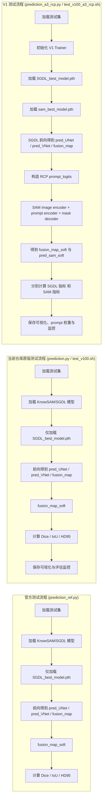

# 原版测试流程 vs V1 测试流程 vs 官方测试流程 对照说明

更新时间：2026-05-07

## 1. 文档目的

本文档用于回答四个问题：

1. `KnowSAM` 官方测试流程到底是什么？
2. 当前仓库原版测试流程与官方测试流程有何关系？
3. `V1` 的测试流程与官方/原版是否一致？
4. `V1` 的测试流程是否会影响学术性严谨性？

先给结论：

1. **官方测试流程**和**当前仓库原版测试流程**在评价口径上本质一致，都是只评估 `SGDL/fusion_map` 的最终分割结果。
2. `V1` 测试流程与官方/原版**不完全一致**，因为 `V1` 在推理阶段显式保留了 `SAM` 提示与解码过程。
3. 这种不一致**不等于不严谨**，前提是论文或汇报中明确说明：  
   - 哪个结果是“官方兼容口径”  
   - 哪个结果是“V1 完整方法口径”
4. 如果把 `V1` 的完整推理结果直接拿去和官方 `KnowSAM` 的 `SGDL-only` 测试结果做单表比较，而不说明口径差异，那么**会影响学术严谨性**。

---

## 2. 三套测试流程总览图



---

## 3. 官方测试流程是什么

你提供的官方参考脚本是：

[prediction_ref.py](F:/postgraduate/KnowSAM/KnowSAM/prediction_ref.py)

它的核心行为是：

1. 加载测试集；
2. 初始化 `KnowSAM(args)`；
3. 仅加载 `SGDL_model_path`；
4. 前向得到：
   - `pred_UNet`
   - `pred_VNet`
   - `fusion_map`
5. 对 `fusion_map_soft` 做评估。

对应关键位置：

1. 初始化模型：`SGDL_model = KnowSAM(args, ...)`
2. 加载权重：只加载 `args.SGDL_model_path`
3. 前向输出：`pred_UNet, pred_VNet, ..., fusion_map = SGDL_model(test_image)`
4. 评估对象：`fusion_map_soft`

### 3.1 官方脚本里为什么有 `sam_model_path` 但没用

在 [prediction_ref.py](F:/postgraduate/KnowSAM/KnowSAM/prediction_ref.py) 中确实定义了：

1. `--sam_model_path`
2. `--SGDL_model_path`

但实际执行时：

1. `SGDL_model_path` 被使用了
2. `sam_model_path` 没有被加载

这说明官方参考测试脚本的实际评价口径是：

**只测试训练后得到的 `SGDL/fusion_map`，不在测试阶段重新跑 `SAM` 分支。**

所以官方测试流程的本质是：

```text
训练时：SAM 辅助 SGDL 学习
测试时：只看学好的 SGDL 输出
```

---

## 4. 当前仓库原版测试流程是什么

当前仓库原版测试入口是：

1. [test_v100.sh](F:/postgraduate/KnowSAM/KnowSAM/test_v100.sh)
2. [prediction.py](F:/postgraduate/KnowSAM/KnowSAM/prediction.py)

它和官方测试流程的逻辑本质一致：

1. 只加载 `SGDL_best_model.pth`
2. 不加载 `sam_best_model.pth`
3. 不重新走 `SAM prompt -> mask decoder` 推理链
4. 评估对象仍然是 `fusion_map_soft`

差异只在于工程化增强：

1. 原版仓库脚本更简单
2. 当前仓库 `prediction.py` 增加了：
   - 日志记录
   - case 级 csv/json
   - overlay 可视化
   - monitor 统计图

所以当前仓库原版测试流程可以理解为：

**在保持官方评价口径不变的前提下，做了更完整的工程封装。**

### 4.1 结论

因此，当前仓库原版测试流程与官方测试流程在学术意义上是**一致的**：

1. 都测试 `SGDL/fusion_map`
2. 都不在测试阶段重新启用 `SAM`
3. 都属于“官方兼容口径”

---

## 5. V1 测试流程是什么

`V1` 测试入口是：

1. [prediction_a3_rcp.py](F:/postgraduate/KnowSAM/KnowSAM/variants/A3_RCP_KnowSAM/prediction_a3_rcp.py)
2. [test_v100_a3_rcp.sh](F:/postgraduate/KnowSAM/KnowSAM/variants/A3_RCP_KnowSAM/test_v100_a3_rcp.sh)

它与官方/原版最大的不同是：

### 5.1 V1 会同时加载两套权重

1. `SGDL_best_model.pth`
2. `sam_best_model.pth`

### 5.2 V1 会重新执行完整的推理闭环

V1 在测试阶段不是只跑 `SGDL`，而是显式执行：

1. `SGDL` 前向得到 `pred_UNet / pred_VNet / fusion_map`
2. 依据 `pred_UNet_soft + pred_VNet_soft + fusion_map_soft` 构造 `prompt_logits`
3. 将 `prompt_logits` 作为 `mask prompt` 输入 `SAM`
4. 得到 `pred_sam_soft`
5. 同时输出：
   - `SGDL` 结果
   - `SAM` 结果
   - `prompt_weight_mean`

也就是说，V1 测试阶段测的是：

**完整的 A3-RCP-KnowSAM 推理过程**

而不是：

**被 SAM 训练过、但推理时不再用 SAM 的 SGDL-only 结果**

---

## 6. 三套流程的本质区别是什么

### 6.1 官方流程

测的是：

**训练后 SGDL 的最终融合输出性能**

### 6.2 当前仓库原版流程

测的是：

**同样的 SGDL 最终融合输出性能，只是增加了工程化记录**

### 6.3 V1 流程

测的是：

**包含 RCP 提示生成与 SAM 解码在内的完整 V1 推理性能**

所以三者之间的真正差异不是“代码写法”，而是：

**评估对象不完全一样。**

---

## 7. V1 测试流程会不会影响学术性严谨性

### 7.1 先给结论

**V1 测试流程本身不会自动破坏学术严谨性。**

但前提是：

1. 你必须明确说明它的评价口径；
2. 你不能把它伪装成和官方完全同口径的结果；
3. 你最好同时保留一套“官方兼容口径”的测试结果。

### 7.2 为什么说“本身不破坏严谨性”

因为如果 `V1` 的方法定义本来就包含：

1. 推理阶段的 `RCP prompt`
2. 推理阶段的 `SAM` 协同

那么测试时保留 `SAM` 是合理的。  
这属于：

**按方法真实推理路径进行评估。**

从方法论文角度看，这是严谨的，因为你测的是“方法本身”，而不是“方法删掉一半后的结果”。

### 7.3 什么情况下会破坏严谨性

如果出现以下情况，就会影响严谨性：

1. 在表格里把 `V1 完整推理结果` 和 `官方 SGDL-only 结果` 放一起，但不说明口径不同；
2. 把 `V1` 的 `SAM+SGDL` 联合推理结果直接声称为“严格可比于官方 KnowSAM 测试结果”；
3. 不说明 `V1` 测试额外加载了 `sam_best_model.pth` 和新的 prompt 生成机制。

这样会让审稿人或导师认为：

**你比较的不是同一个 evaluation protocol。**

这就不严谨了。

---

## 8. V1 是否与原版/官方测试流程一致

### 8.1 严格回答

**不一致。**

### 8.2 为什么不一致

因为原版/官方测试流程是：

```text
只加载 SGDL_best_model
只评估 fusion_map
```

而 V1 测试流程是：

```text
加载 SGDL_best_model + sam_best_model
重新构造 prompt_logits
重新执行 SAM 解码
评估 SGDL 和 SAM 两类输出
```

所以它们的推理路径不一样，评估对象也不完全一样。

### 8.3 能不能说“部分一致”

可以。

更准确的说法是：

1. 在数据集、指标、基础分割任务定义上，V1 与原版/官方一致；
2. 在推理图和模型加载方式上，V1 与原版/官方不一致；
3. 因此，V1 不是“官方兼容测试流程”，而是“V1 自身完整方法测试流程”。

---

## 9. 最严谨的学术做法是什么

如果你后续要写论文、汇报或和导师讨论，最严谨的做法是：

### 9.1 同时保留两套测试口径

#### 口径 A：官方兼容口径

只测 `SGDL/fusion_map`，与官方/原版完全对齐。  
用途：

1. 与官方 KnowSAM 做公平 baseline 对比
2. 回答“如果按原版测试逻辑，你的方法改动后 SGDL 本身有没有提升”

#### 口径 B：V1 完整方法口径

测试 `RCP + SGDL + SAM` 的完整推理结果。  
用途：

1. 回答“如果把 V1 当成一个完整新方法，它最终推理性能如何”
2. 展示方法真实部署路径下的收益

### 9.2 论文/表格里建议怎么写

建议在结果表中明确标注：

1. `KnowSAM (official protocol)`
2. `KnowSAM (our re-implementation protocol)`
3. `A3-RCP-KnowSAM (official-compatible SGDL-only protocol)`
4. `A3-RCP-KnowSAM (full inference protocol)`

这样最清楚，也最不容易被质疑。

---

## 10. 推荐表述

你可以在文档或答辩里这样说：

> 官方 KnowSAM 的测试流程本质上是 SGDL-only evaluation，即训练时由 SAM 辅助学习，但测试时只评估 SGDL 的 fusion 输出。当前仓库原版 `prediction.py` 与官方流程在评价口径上保持一致，只是增加了日志和可视化。相比之下，V1 的 `prediction_a3_rcp.py` 测的是完整的 A3-RCP-KnowSAM 推理路径，它会在测试阶段重新构造可靠性校准 prompt，并重新启用 SAM 解码。因此，V1 与官方流程并非严格同口径。为了保证学术严谨性，后续结果展示应同时保留“官方兼容口径”和“V1 完整方法口径”两套结果。

---

## 11. 最终结论

最后用四句话总结：

1. **官方测试流程只评估 `SGDL/fusion_map`，不重新使用 `SAM`。**
2. **当前仓库原版测试流程与官方在学术评价口径上是一致的。**
3. **V1 测试流程不与官方/原版完全一致，因为它评估的是完整的 `RCP + SAM + SGDL` 推理链。**
4. **V1 本身并不不严谨，但必须明确区分“官方兼容口径”和“V1 完整方法口径”，否则会影响结果比较的公平性。**
